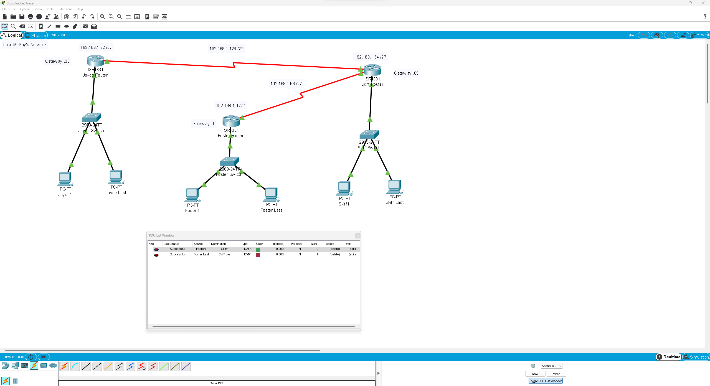
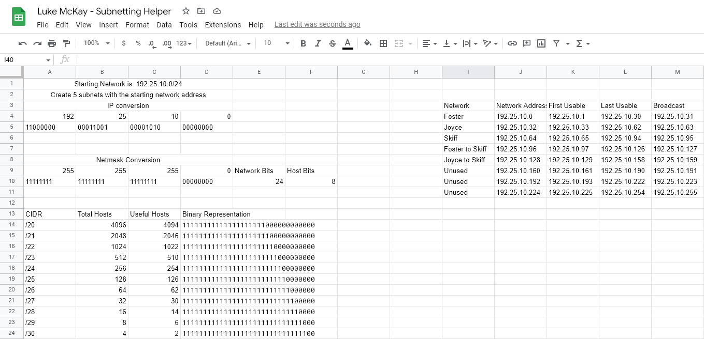

---
layout:
  title:
    visible: true
  description:
    visible: true
  tableOfContents:
    visible: true
  outline:
    visible: true
  pagination:
    visible: false
---

# Classful Subnetting

## In this lab we created a network with 5 subnets:&#x20;

<figure><figcaption>
5 Subnet Network
</figcaption></figure>

### During this lab, I learned about the following:

* How to subnet with a select number of host devices.&#x20;
* Broadcast address&#x20;
* Last usable IP address&#x20;
* First usable IP address&#x20;
* How to convert IPs , netmasks, and CIDR's into binary.&#x20;
* CIDR's&#x20;
* Serial interfaces&#x20;
* Gigabit interfaces
* Clocked connections&#x20;

### I also created a google spreadsheet to help with subnetting and conversions for the future:

<figure><figcaption>
Subnetting Helper
</figcaption></figure>

### Important things to remember

1. Set the same clock speed between all serial connections.&#x20;
2. Set the same subnet mask between all devices&#x20;
3. Label your network in packet tracer&#x20;
4. In a network there are total hosts, and useful hosts. `Useful hosts = total hosts - 2`, this is because 2 host IP's are already being used by default: &#x20;
   1. Network Address IP
   2. Broadcast Address IP
