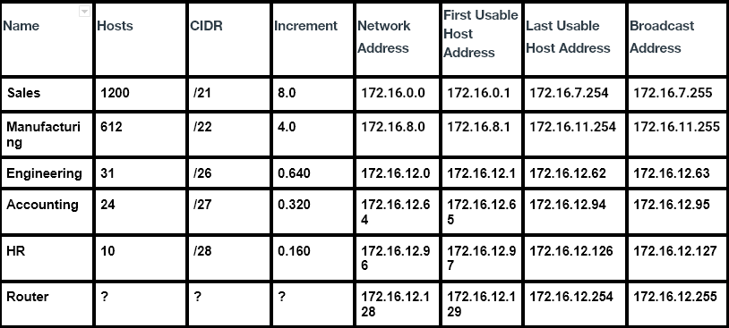
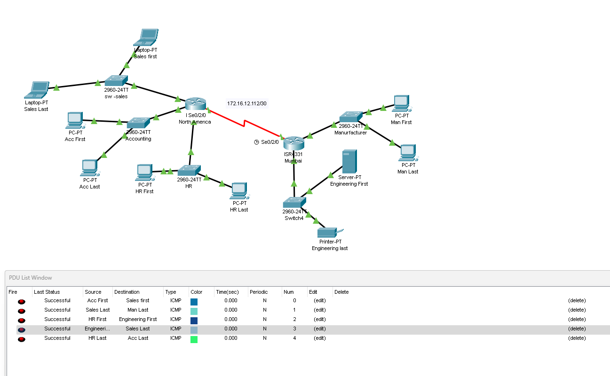

---
layout:
  title:
    visible: true
  description:
    visible: true
  tableOfContents:
    visible: true
  outline:
    visible: true
  pagination:
    visible: false
---

# VLSM

## Background

PPC uses the private class B space of 172.16.0.0/16.  Currently all hosts are on the same network which is causing hate and discontent due to network performance impacts.  Here is some information which may help you in designing your subnet scheme.

### Mumbai Divisions

* Manufacturing will need 612 hosts
* Engineering will need 31 hosts

### North American Divisions

* Sales is the largest division with a host requirement of 1200
* HR needs 10 hosts&#x20;
* Accounting will need space for 24 hosts (note gateways are part of this number too)&#x20;

<figure><figcaption>
Subnet Table
</figcaption></figure>

<figure><figcaption>
Simulated Network
</figcaption></figure>

## Reflection&#x20;

The toughest portion of the lab was just figuring out how to create the subnets. Figuring it out will assist me for future subnetting.
