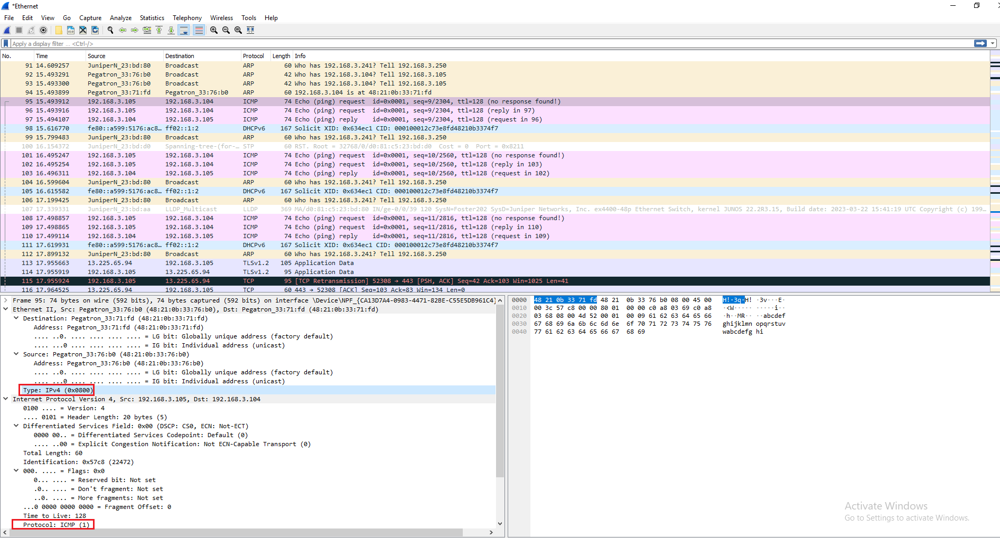

# OSI Observation Capture

<figure><figcaption>
ipconfig/all in cmd  
</figcaption></figure>

Default gateway is 192.168.3.250&#x20;

<figure><figcaption>
wireshark 
</figcaption></figure>

## I pinged the default gateway from cmd, and I am observing the packets. (ICMP)&#x20;

### Ping request:&#x20;

Destination MAC is d0:81:c5:23:bd:80

Source MAC is 48:21:0b:33:76:b0 &#x20;

### Ping reply:&#x20;

Destination MAC is 48:21:0b:33:76:b0&#x20;

Source MAC is d0:81:c5:23:bd:80&#x20;

My workstations NIC MAC: 48:21:0b:33:76:b0&#x20;

Default gateway's NIC MAC: d0:81:c5:23:bd:80&#x20;

### I pinged 34.174.229.22:&#x20;

Source MAC: 48:21:0b:33:76:b0&#x20;

Destination MAC: d0:81:c5:23:bd:80

MAC of 34.174.229.22 is unkown because wireshark only captures the default gateway MAC. MAC is used for local network communication.&#x20;

### I pinged my neighbor's workstations ip (192.168.3.104)&#x20;

ICMP ping request:&#x20;

Source MAC: 48:21:0b:33:76:b0&#x20;

Destination MAC: 48:21:0b:33:71:fd&#x20;

My neighbor's Workstation's MAC is 48:21:0b:33:71:fd  &#x20;

## Inspecting a ICMP request packet:&#x20;

<figure><figcaption>
Inspecting the headers and fields on a ICMP request packet in wireshark
</figcaption></figure>

**The field in the Ethernet header that indicates the next layer's header**

Type: IPv4 (0x0800)

**The field in the IPv4 header that indicates the next layer's header**

Protocol: ICMP (1)&#x20;

### The first 6 bytes of the packet are the source or destination hardware address (eth.addr). In this particular case, it is the destination MAC.

