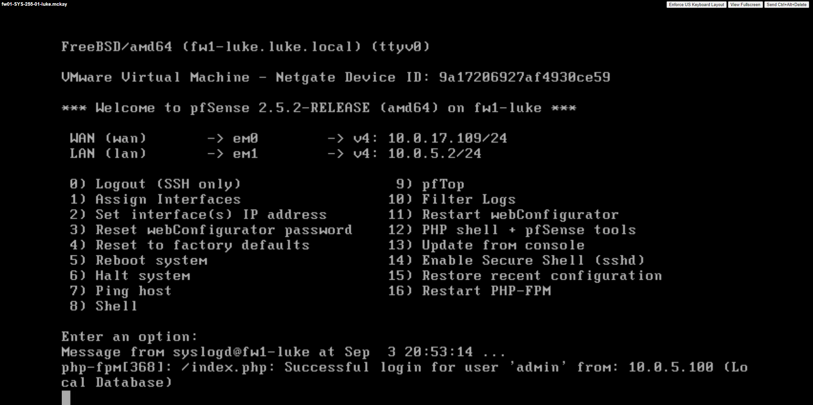

# Packet Headers

<figure><figcaption><p>Observing a HTTP packet in Wireshark</p></figcaption></figure>

14 bytes are included in the Ethernet II header.&#x20;

6 bytes represent the destination MAC and 6 bytes represent the source MAC.

Destination bytes:

`84 17 ef eb d1 bb`&#x20;

Source bytes:&#x20;

```
28 3a 4d 84 e1 7f
```

The Internet Protocol Version 4 header contains 20 bytes.&#x20;

We see the ethernet header as the first bytes in the packet because it is part of the physical layer on the OSI model. The headers seem to go in order on the OSI model. &#x20;


The ARP response packet's ethernet II header is 32 bytes. The Ethernet II padding is 18 bytes.&#x20;


<figure><figcaption><p>Observing an ARP response packet in Wireshark</p></figcaption></figure>

The ARP response packet's ethernet II footing (padding) is applied to the frame because the frame needs to reach a minimum required amount of bytes. The padding contains no useful information.
