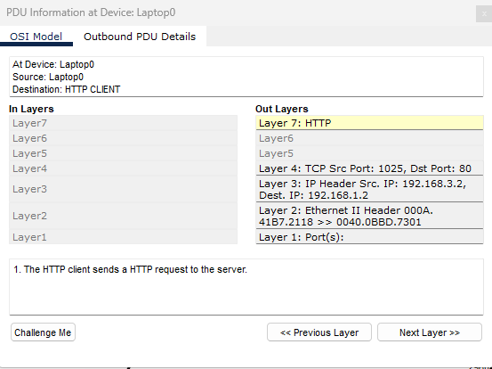

# Lab 1-1: Simple Network Hardware

Screenshots and notes:&#x20;

<figure><figcaption></figcaption></figure>

<figure><figcaption></figcaption></figure>

<figure><figcaption></figcaption></figure>

### FastEthernet Lab Commands:&#x20;

| Section             | Command                               | What Occurs:                                                    |
| ------------------- | ------------------------------------- | --------------------------------------------------------------- |
| Router #            | enable                                | This command enables the router                                 |
| Router #            | Conf t                                | This command entered the config menu                            |
| Router(config) #    | interface fastethernet 0/0            | Use the fastethernet 0/0 port connection                        |
| Router(config-if) # | Ip address 192.168.3.1 255.255.255.0  | Set the fastethernet 0/0 ip to 192.168.3.1/24                   |
| Router(config-if) # | No shutdown                           | Keep fastethernet 0/0 up no matter what                         |
| Router (config-if)# | exit                                  | Exit fastethernet 0/0                                           |
| Router(config) #    | interface fastethernet 0/1            | Use the fastethernet 0/1 port connection                        |
| Router(config-if) # | #ip address 192.168.1.1 255.255.255.0 | Set the fastethernet 0/1 ip to 192.168.1.1/24                   |
| Router(config-if) # | No shutdown                           | Keep fastethernet 0/1 up no matter what                         |
| Router (config-if)# | exit                                  | Exit fastethernet 0/1                                           |
| Router(config) #    | exit                                  | Exit the config menu                                            |
| Router#             | show ip int                           | This shows the interface including the IP address spaces leased |
| Router#             | show ip interface                     | This shows the interface including the IP address spaces leased |
| Router#             | copy run start                        | This saves the status of the router                             |

Deliverables:

Deliverable 1: Set the IP space of device 1 to 192.168.3.5 and device 2 to 192.168.1.5 and attempt to ping 1.5 from 3.5 through the router connection.

\

\
